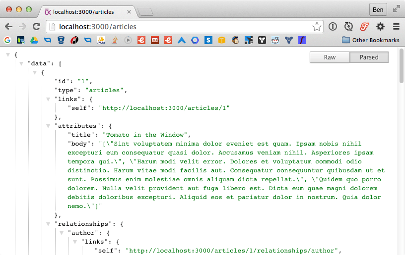
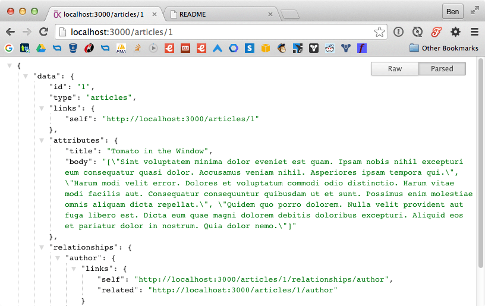
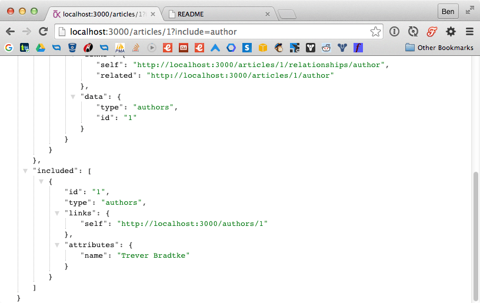
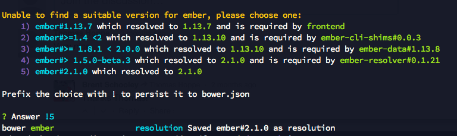

# JSON API with Ember Data 2.1

When Ember 1.13 was released, the biggest change was a total overhaul of Ember Data's internal format and the Serializer API to follow the JSON API specification. The JSON API specification (seen [here](http://jsonapi.org/)) has been in the works for a few years, and recently 1.0 specification was released.

Ember's core team designed this change to operatate *mostly* transparently; in general, you didn't have to do much to update to Ember 1.13 unless you were doing some super custom serialization. 

With previous versions of Ember, if you were using Rails, you were probably using the [active_model_serializers](https://github.com/rails-api/active_model_serializers) gem and the output probably looked something like this:

```json
{
  "article": {
      "id": 1,
      "title": "JSON API with Ember Data 2.1",
      "author_id": 1
  },
  "authors": [
    {
      "id": 1,
      "name": "Ben Borowski"
    }
  ]
}
```

A JSON API compliant output will look more like the following:

```json
{
  "data": {
    "type": "article",
    "id": 1,
    "attributes": {
      "title": "JSON API with Ember Data 2.1"
    },
    "relationships": {
      "author": {
        "data": { "id": 1, "type": "author" }
      }
    }
  },
  "included": [
    {
      "id": 1,
      "type": "authors",
      "attributes": { "name": "Ben Borowski" }
    }
  ]
}
```

You can see here that the "type" and "id" of the object is stored as a separate key on "data", instead of containing all the "attributes" under the object type key. Certainly a bit more complex, but not too different. Now then, if you've been using *active_model_serializers* up until now, how do you get your data in a similar format with Rails?

At the moment, there are two decent options. You *could* use the master branch of *active_model_serializers* and set your adapter to the `JsonApi` adapter:

```ruby
ActiveModel::Serializer.config.adapter = :json_api
```

If you're starting with a new project though, I'd defintely recommend you jump straight to using the [jsonapi-resources](https://github.com/cerebris/jsonapi-resources) gem. It's a bit more "spec-complete" at the moment, plus it's written by some of the same folks that are working on the JSON API specification (mostly [Dan Gebhardt](https://twitter.com/dgeb), from the looks of it).

## Rails

Let's start with a new Rails application:

    $ rails new -d postgresql backend
    $ bundle exec rake db:create

And we'll add two models/migrations to our database (we'll build everyone's favorite Rails demo, a blog):

    $ rails generate model Author name:string
    $ rails generate model Article title:string body:text author:references

Finally, let's migrate our database:

    $ bundle exec rake db:migrate

I'll also add some seed data to *db/seeds.rb* to get us started. I'm going to use the [Faker](https://github.com/stympy/faker) gem to add some test data, so add to your *Gemfile*:

    gem 'faker', '~> 1.5.0'

and

    $ bundle install

to install the Faker gem. Finally, let's add some data in *db/seeds.rb*:

```ruby
author = Author.create(name: Faker::Name.name)
5.times do
  Article.create(title: Faker::Book.title, body: Faker::Lorem.paragraphs.join("\n\n"), author: author)
end
```

To get the data into the database, run the seeder:

    $ bundle exec rake db:seed

Let's see what we got via the console:

    $ rails console
    > Article.all.collect(&:title)
      Article Load (0.5ms)  SELECT "articles".* FROM "articles"
      => ["Tomato in the Window", "Next Day Previous Night", "Falling Flags", "Same Way Through", "The Frog Catchers Field Manual"]

Fantastic! We've got our simple data structure, a database, and some seed data. Now let's make a JSON API-compliant API!

### Enter jsonapi-resources

We'll get started on the API by adding the jsonapi-resources gem. Add the following to your Gemfile:

    gem 'jsonapi-resources', '~> 0.6.1'

and install it:

    $ bundle install

The most basic component of jsonapi-resources is the `Resource`. These define the public interface to your API. In general, each of your models will have a corresponding resource. Let's start by creating resources for our two models:

    $ rails generate jsonapi:resource author
    $ rails generate jsonapi:resource article

This will generate two resource files in the default location (in *app/resources*). Edit those to define the attributes you want to include on the resource and define the relationships:

```ruby
# app/resources/author_resource.rb
class AuthorResource < JSONAPI::Resource
  attribute :name
end

# app/resources/article_resource.rb
class ArticleResource < JSONAPI::Resource
  attributes :title, :body
  has_one :author
end
```

You'll note this looks pretty familiar if you've already been using *active_model_serializers*.

### Routing to resources

The gem provides some very powerful features to set up an API without much code. First let's use the routing API and update *config/routes.rb*:

```ruby
Rails.application.routes.draw do
  jsonapi_resources :articles
  jsonapi_resources :authors
end
```

Note here that we're using `jsonapi_resources` and not the standard Rails `resources` route helper. Now we can expect the routes it's created from the command line:

    $ rake routes

                              Prefix Verb      URI Pattern                                          Controller#Action
    article_relationships_author GET       /articles/:article_id/relationships/author(.:format) articles#show_relationship {:relationship=>"author"}
                                 PUT|PATCH /articles/:article_id/relationships/author(.:format) articles#update_relationship {:relationship=>"author"}
                                 DELETE    /articles/:article_id/relationships/author(.:format) articles#destroy_relationship {:relationship=>"author"}
                  article_author GET       /articles/:article_id/author(.:format)               authors#get_related_resource {:relationship=>"author", :source=>"articles"}
                        articles GET       /articles(.:format)                                  articles#index
                                 POST      /articles(.:format)                                  articles#create
                         article GET       /articles/:id(.:format)                              articles#show
                                 PATCH     /articles/:id(.:format)                              articles#update
                                 PUT       /articles/:id(.:format)                              articles#update
                                 DELETE    /articles/:id(.:format)                              articles#destroy
                         authors GET       /authors(.:format)                                   authors#index
                                 POST      /authors(.:format)                                   authors#create
                          author GET       /authors/:id(.:format)                               authors#show
                                 PATCH     /authors/:id(.:format)                               authors#update
                                 PUT       /authors/:id(.:format)                               authors#update
                                 DELETE    /authors/:id(.:format)                               authors#destroy


Wow, so it's set up an entire RESTful routing sytem to do all the things we'd want to do with our articles and authors. We've even got some routes for fetching relationships on each of our models. So how do we handle these actions? Next we'll add some controllers to handle the requests:

```ruby
# app/controllers/articles_controller.rb
class ArticlesController < JSONAPI::ResourceController
end

# app/controllers/authors_controller.rb
class AuthorsController < JSONAPI::ResourceController
end
```

Start up rails if you haven't yet and navigate to http://localhost:3000/articles.



How about a single article? http://localhost:3000/articles/1.



Okay, wow, it looks like our API is pretty much "done!" We can even post to the collection endpoints to create resources:

    $ curl -i -H "Accept: application/vnd.api+json" -H 'Content-Type:application/vnd.api+json' -X POST -d '{"data": {"type":"authors", "attributes":{"name":"Fake Kname"}}}' http://localhost:3000/authors

You can add `?include=author` to the URL to side load the author data as well `http://localhost:3000/articles/1?include=author`:



### Serializers

If you need to do operations in your actions that are more complex, you can implement the action yourself. You can use JSONAPI's `ResourceSerializer` to serialize your resource to a jsonapi-compliant object:

```ruby
def show
  # model
  article = Article.find(params[:id])

  # resource for model
  resource = ArticleResource.new(article, nil)

  # serializer for resource
  serializer = JSONAPI::ResourceSerializer.new(ArticleResource)

  # jsonapi-compliant hash (ready to be send to render)
  render json: serializer.serialize_to_hash(resource)
end
```

There's lots more you can do to restrict access to resources, filter the data, etc., so I recommend you read the [primary README file on GitHub](https://github.com/cerebris/jsonapi-resources/blob/master/README.md) as it's loaded with great info. We've got a basic API to do CRUD operations with Ember, though, so let's create our Ember app.


## Ember.js

Let's start by creating a new application with Ember CLI along-side the rails *backend* folder:

    $ ember new frontend

Ember CLI is currently locked to Ember 1.13.x (this is going to change very shortly), so first thing we'll do is update those dependencies:

    $ npm install ember-data@2.1.0 --save-dev
    $ bower install ember#2.1.0 --save
    $ bower install ember-data#2.1.0 --save

If bower asks you to select a version, choose the one that persists the 2.1.0 version, like so:



Great, now you're running Ember 2.1 when you run `ember serve`.

### Models

Let's generate models for the models we already created in the backend.
    
    $ ember generate model author name:string
    $ ember generate model article title:string body:string author:belongs-to:author

### Display the articles

First let's generate a view to display a list of articles in:

    $ ember generate route articles

Edit the generated route in *app/routes/articles.js*:

```js
import Ember from 'ember';

export default Ember.Route.extend({
  model() {
    return this.store.findAll('article');
  }
});
```    


and then open up *app/templates/articles.hbs* and add a list of articles based on the model we're fetching:

```hbs
{{#each model as |article|}}
  <p>
    {{article.title}} by <em>{{article.author.name}}</em>
  </p>
{{/each}}
```

Finally, let's start the Ember server up and proxy all requests to the Rails application (which should be running too):

    $ ember serve --proxy=http://localhost:3000

Hitting [http://localhost:4200/articles](http://localhost:4200/articles) should show a list of articles with authors now. 


You may find that the author names do not display, if so, check your console output. It probably has to do with a Cross-Origin Resource Sharing (CORS) issue. To solve it, shut down the rails server and follow along with the next section. 

## CORS

We'll add the [rack-cors](https://github.com/cyu/rack-cors) gem to handle the CORS configuration for us:

```ruby
gem 'rack-cors', require: 'rack/cors'
```

Install the gem:

    $ bundle install

Add the following snippet to your *config/application.rb*:

```ruby
config.middleware.insert_before 0, "Rack::Cors", :debug => true, :logger => (-> { Rails.logger }) do
  allow do
    origins '*'
    resource '/cors', :headers => :any, :methods => [:post], :credentials => true, :max_age => 0
    resource '*', :headers => :any, :methods => [:get, :post, :delete, :put, :patch, :options, :head], :max_age => 0
  end
end
```

Great, now start up the Rails server again and head back to your Ember app. The articles should be loading the author now as well. There may be some other warnings in the console that you'll have to resolve for a production app, but for our demo, we can safely ignore those for now.

## Pagination data

### Setting up Rails

jsonapi-resources makes paginating data a snap. No additional gems required. We can add an initializer to configure pagination like so (the default is `:none` pagination):

```ruby
# config/initializers/jsonapi_resources.rb
JSONAPI.configure do |config|
  # built in paginators are :none, :offset, :paged
  config.default_paginator = :paged

  config.default_page_size = 2
  config.maximum_page_size = 20
end
```

Restart Rails and navigate to <a href="http://localhost:3000/articles">http://localhost:3000/articles</a> and you'll only see 2 items instead of 5. Add <a href="http://localhost:3000/articles?page=2">?page=2</a> to the URL to see the next set of articles.

The URL params for pagination are not well documentated at this point. You can either use an integer like `page=2` or you can break down into parts with `page[number]=1&page[size]=1`. Number is the page number you want and size being your "per page" value.

### Ember pagination is hard.

Paginating on the Ember side gets a bit more complex. You'll need to use extracted meta data from the JSON response to tell which page you're on. jsonapi-resources [doesn't handle meta](https://github.com/cerebris/jsonapi-resources/issues/89) out of the box quite yet, but there are [solutions that involve manual serialization](https://github.com/cerebris/jsonapi-resources/issues/89#issuecomment-101740062) that seem reasonable. 

Using this method, you could then drop in the ember-cli-pagination addon to get frontend pagination for free. 

Another article focused on pagination will probably be appropriate down the road. 

## Editing

Let's see how editing a resource with jsonapi-resources works. Add a new route to Ember:

    $ ember generate route article/edit

Change the route path in *app/router.js*:

```js
this.route('article', function() {
  this.route('edit', { path: ':id/edit' });
});
```

And edit the route in *app/routes/article/edit.js*:

```js
import Ember from 'ember';

export default Ember.Route.extend({
  model(params) {
    return this.store.findRecord('article', params.id, { reload: true });
  },
  actions: {
    savePost() {
      let model = this.get('controller.model');
      model.save().then(() => {
        console.info('saved!');
      });
    }
  }
});
```

Finally, let's create a super quick form to edit the data in *app/templates/article/edit.hbs*:

```hbs
<p>
  {{input value=model.title}}
</p>
<p>
  {{textarea value=model.body}}
</p>

<button {{action "savePost"}}>Save</button>
```

Clicking the button will pass up the `savePost` action to route and Ember Data will fire off a PATCH request to Rails which updates the model. You can inspect this request in the console. Preview this new route at [http://localhost:4200/articles/1/edit](http://localhost:4200/articles/1/edit).

We can also update the articles index template to add links to our new edit page:

```hbs
{{#link-to "article.edit" article}}
  {{article.title}} by <em>{{article.author.name}}</em>
{{/link-to}}
```

and redirect us back to the index when we've saved a post:

```js
// in routes/article/edit.js
model.save().then(() => {
  console.info('saved!');
  this.transitionTo('articles');
});
```

## Wrap-up

Obviously this is a very simple example, but shows how to setup jsonapi-resources to start using the latest Ember recommended spec. You can find the [source code for this application](https://github.com/emberyvr/jsonapi-resources-demo) on github as part of the demo talk I gave at a [Ember.YVR](http://meetup.com/Vancouver-Ember-js/) meetup.
